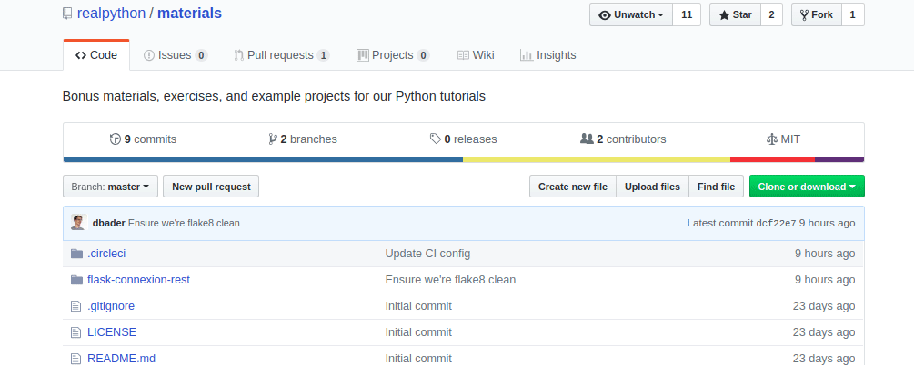

# Itertools in Python 3, By Example

> Supplemental materials for the [Itertools in Python 3, By Example](https://realpython.com/python-itertools/) article on [Real Python](https://realpython.com).

This folder contains content for two examples from the article: [Analyzing the S&P500](https://realpython.com/python-itertools/#analyzing-the-sp500) and [Building Relay Teams from Swimmer Data](https://realpython.com/python-itertools/#building-relay-teams-from-swimmer-data).

## Downloading the Files

### With `git`

If you have `git` installed, the easiest way to access these files is to clone the repository to the directory of your choice:

```console
$ git clone https://github.com/realpython/materials.git
```

Then `cd` into the `itertools-in-python3` directory:

```console
$ cd materials/itertools-in-python3
```

### Without `git`

Alternatively, you can download the entire repository as a `.zip` file from the repository's [homepage](https://github.com/realpython/materials) using the green "Clone or download" button in the top right hand corner.



## Running the Code Examples

To run the code examples, first make sure you have Python 3 installed on your machine. **The code examples WILL NOT work with Python 2.** If you need help installing Python 3, check out Real Python's [Python 3 Installation & Setup Guide](https://realpython.com/installing-python/).

To run the `sp500.py` file, type `python3 sp500.py` into your terminal. Here's how that looks, with output:

```console
$ python3 sp500.py
Max gain: 11.58% on 2008-10-13
Max loss: -20.47% on 1987-10-19
Longest growth streak: 14 days (1971-03-26 to 1971-04-15)
```

> **Note:** Depending on your installation, you may need to type `python3.6` or `python36` to run the examples. If you follow the [Python 3 Installation & Setup Guide](https://realpython.com/installing-python/), you should have no problem.

Similarly, for `swimmers.py`:

```console
$ python3 swimmers.py
Backstroke A: Sophia, Grace, Penelope, Addison
Backstroke B: Elizabeth, Audrey, Emily, Aria
Breaststroke A: Samantha, Avery, Layla, Zoe
Breaststroke B: Lillian, Aria, Ava, Alexa
Butterfly A: Audrey, Leah, Layla, Samantha
Butterfly B: Alexa, Zoey, Emma, Madison
Freestyle A: Aubrey, Emma, Olivia, Evelyn
Freestyle B: Elizabeth, Zoe, Addison, Madison
```
