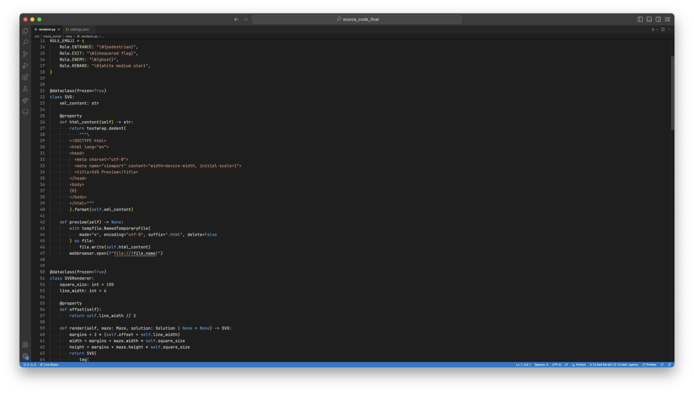
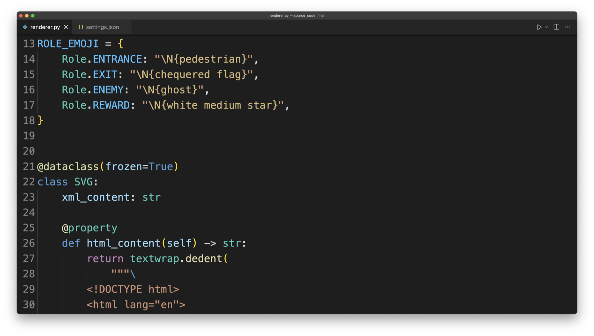

# How to Make Engaging Programming Videos

This repository provides the VS Code settings file that's mentioned in the Real Python [How to Make Engaging Programming Videos](https://realpython.com/how-to-make-programming-videos/) tutorial.

## Using the Settings

The provided settings file helps you to have a clutter-free and readable VS Code editor for the project that you want to record in a video.

Here's an example folder structure to show where you can find your existing workspace settings file:

```
project/
│
├── .vscode/
│   └── settings.json
│
└── code.py
```

If the `.vscode/` folder and the `settings.json` don't exist, then you can create the file with the contents of [settings.json](settings.json). If you already have an existing settings file, then you may only copy the configuration objects that you want to use.

To learn more about adjusting your VS Code settings, check out the VS Code documentation on [user and workspace settings](https://code.visualstudio.com/docs/getstarted/settings#_settingsjson).

## Before

[](before.png)

## After

[](after.png)

## Author

- **Philipp Acsany**, E-mail: [philipp@realpython.com](philipp@realpython.com)

## License

Distributed under the MIT license. See [`LICENSE`](../LICENSE) for more information.
