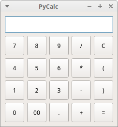
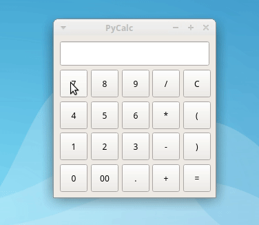

# PyCalc

PyCalc is a sample calculator implemented using Python 3 and with a [PyQt5](https://www.riverbankcomputing.com/static/Docs/PyQt5/introduction.html) GUI. PyCalc implements the most basic math operations, that is, division, multiplication, addition, and subtraction.

PyCalc is intended to be a demonstrative example on how you can implement a Python + PyQt5 GUI application using the Model-View-Controller (MVC) pattern.

## Screenshot



## Requirements

For PyCalc to work, you need to have a proper installation of [Python](https://www.python.org) >= 3.6. Then you need to install the PyQt5 library in your system. This can be done by using `pip3` as follows:

```console
$ sudo pip3 install pyqt5
```

We don't recommend you to install PyCalc's requirements directly into your system, as PyCalc is just a sample application. So, you can use a virtual environment to test PyCalc out. To do that, you can run the following commands:

```console
$ python3 -m venv pycalc
$ source pycalc/bin/activate
$ pip install pyqt5
```

After this steps are finished, you can run and test PyCalc as described in the next section.

**Note**: For more information on how to install PyQt5, you can take a look at the related topic on the [project's documentation](https://www.riverbankcomputing.com/static/Docs/PyQt5/installation.html).

## How to Run PyCalc

To run PyCalc from your system's command-line and try it out, you can execute the following command:

```console
$ python3 pycalc.py
```

After running this command, you'll see PyCalc running on your screen.

## How to Use PyCalc

To use PyCalc, you just need to enter a valid math expression using your mouse and then press `Enter` or click on the `=` sign:



## About the Author

My name is Leodanis Pozo Ramos. I'm a **freelance Python Developer, and [author](https://realpython.com/team/lpozoramos/)**. If you need more information about me, and my work, then you can take a look at my [personal page](https://lpozo.github.com/).

## License

PyCalc is released under the [MIT License](https://opensource.org/licenses/MIT).
